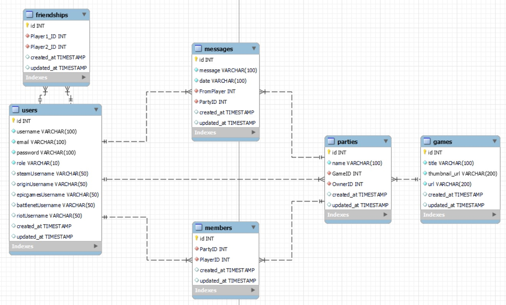

# Backend PHP Laravel

## Solicitan desde GeeksHubs Academy realizar una aplicación para una empresa. El objetivo es que permita que los empleados puedan contactar con otros compañeros para formar grupos para jugar a un videojuego, con el objetivo de poder compartir un rato de ocio afterwork.

## Los requisitos funcionales de la aplicación son los siguientes:
* Los usuarios se tienen que poder registrar a la aplicación, estableciendo un usuario/contraseña.
* Los usuarios tienen que autenticarse a la aplicación haciendo login.
* Los usuarios tienen que poder crear Parties (grupos) por un determinado videojuego.
* Los usuarios tienen que poder buscar Parties seleccionando un videojuego.
* Los usuarios pueden entrar y salir de una Party.
* Los usuarios tienen que poder enviar mensajes a la Party. Estos mensajes tienen que poder ser editados y borrados por su usuario creador.
* Los mensajes que existan en una Party se tienen que visualizar como un chat común.
* Los usuarios pueden introducir y modificar sus datos de perfil, por ejemplo, su usuario de Steam.
* Los usuarios tienen que poder hacer logout de la aplicación web.

## BASE DE DATOS Y SUS RELACIONES

***

***

* Player tiene una relación con **party de 1:N** (una party solo tiene un player creador, y un player puede ser creador de 0, 1 o varias parties).
* Player tiene una relación con **party de N:N**, creando la tabla **member** (una party puede tener 1 o varios players como miembros, y un player puede pertenecer a 0, 1 o varias parties).
* Player tiene una relacion con **player de N:N**, creando la tabla **friendship** (un player puede ser amigo de 0, 1 o varios players).
* Player tiene una relación con **message de 1:N** (un message solo puede tener un player creador, y un player puede tener 0, 1 o varios messages).
* Message tiene una relación con **party de 1:N** (una party puede tener 0, 1 o varios messages, y un message solo puede tener una party).
* Party tiene una relación con **game de 1:N** (una party solo puede tener un game, y un game puede tener 0, 1 o varias parties).

## TECNOLOGÍAS UTILIZADAS EN EL PROYECTO
* SQL --> usado como sistema de base de datos.
* PHP --> lenguaje de programación usado en la API.
* Composer --> usado como gestor de dependencias.
* Laravel --> framework de PHP usado para la creación de la API.
* Eloquent --> usado para acceso y manejo de la base de datos del proyecto.
* Passport --> usado para el sistema de autenticación en la API.
* Git --> usado para tener alojado el proyecto en repositorio de github.
* Docker --> usado para crear un contenedor de la aplicación.
* Heroku --> usado para tener la API deployada.

## ENDPOINTS DE LA API

* ENLACE A POSTMAN, CONFIGURADO CON TODOS LOS ENDPOINTS (LOCAL)
    * [](https://app.getpostman.com/run-collection/11138723-7f30b435-092e-48c3-93d5-3d97447d1b8f?action=collection%2Ffork&collection-url=entityId%3D11138723-7f30b435-092e-48c3-93d5-3d97447d1b8f%26entityType%3Dcollection%26workspaceId%3D16ffb9c9-152b-4dd3-bcad-3519fd225e65)

* USER
    * Registro de nuevo user -- > /api/newUser (POST)
    * Login en la aplicación --> /api/loginUser (POST)
    * Logout de la aplicación --> 

* PLAYER (PERTENECE A LA TABLA USER)
    * Ver todos los players --> /api/players (GET)
    * Buscar player por ID --> /api/playerByID (POST)
    * Editar player ya existente --> /api/updatePlayer (PUT)
    * Borrar player ya existente --> /api/deletePlayer (DELETE)

* GAME
    * Ver todos los games --> /api/games (GET)
    * Buscar game por ID --> /api/gameByID (POST)
    * Crear game nuevo --> /api/newGame (POST)
    * Editar game ya existente --> /api/updateGame (PUT)
    * Borrar game ya existente --> /api/deleteGame (DELETE)

* PARTY
    * Ver todas las parties --> /api/parties (GET)
    * Buscar party por ID --> /api/partyByID (POST)
    * Buscar party por game --> /api/partyByIDGame (POST)
    * Crear party nueva --> /api/newParty (POST)
    * Editar party ya existente --> /api/updateParty (PUT)
    * Borrar party ya existente --> /api/deleteParty (DELETE)

* MESSAGE
    * Ver todos los messages --> /api/messages (GET)
    * Buscar message por ID --> /api/messageByID (POST)
    * Buscar messages por party --> /api/messageByPartyID (POST)
    * Crear message nuevo --> /api/newMessage (POST)
    * Editar message ya existente --> /api/updateMessage (PUT)
    * Borrar message ya existente --> /api/deleteMessage (DELETE)

* MEMBER
    * Ver todos los members --> /api/members (GET)
    * Buscar member por ID --> /api/memberByID (POST)
    * Buscar member por party --> /api/memberByPartyID (POST)
    * Buscar member por player --> /api/memberByPlayerID (POST)
    * Crear member nuevo --> /api/newMember (POST)
    * Editar member ya existente --> /api/updateMember (PUT)
    * Borrar member ya existente --> /api/deleteMember (DELETE)

* FRIENDSHIP
    * Ver todos los friendships --> /api/friendships (GET)
    * Buscar friendship por ID --> /api/friendshipByID (POST)
    * Buscar friendship por player --> /api/friendshipByPlayerID (POST)
    * Crear friendship nuevo --> /api/newFriendship (POST)
    * Editar friendship ya existente --> /api/updateFriendship (PUT)
    * Borrar friendship ya existente --> /api/deleteFriendship (DELETE)

## MIGRATION Y SEEDERS
* Todas las tablas de la base de datos y los registros de la tabla **games** están creados con archivos de migrations y de seeders (solo se crean registros de games, ya que el registro de usuarios se debe de hacer de manera manual desde la API para poder usar login con token, y el resto de tablas tienen relaciones con la tabla **users**). Para crear tanto las tablas como los registros, además de sobreescribir la información guardada en la base de datos, se usa el siguiente comando:
```
php artisan migrate:fresh --seed
```
* Para que se ejecuten todos los seeders, además, se ha añadido en el archivo **Database\Seeders\DatabaseSeeder** los diferentes seeders que existen en la API.

## IMPLEMENTACIÓN DE SEGURIDAD EN LA API: PASSPORT
* Se instala passport en el proyecto con el siguiente comando:
```
composer require laravel/passport
```
* Al instalar passport se crean migrations nuevos, y debemos de hacer migrate de nuevo para actualizar las tablas de nuestra base de datos.
* Para poder generar tokens de acceso, es necesario ejecutar el siguiente comando:
```
php artisan passport:install
```
* Se comprueba que en model **User** existen las siguientes lineas:
```
use Illuminate\Foundation\Auth\User as Authenticatable;
use Illuminate\Notifications\Notifiable;
use Laravel\Passport\HasApiTokens;
```
* Dentro de la clase **class User extends Authenticatable** tiene que estar la siguiente línea:
```
use Notifiable, HasApiTokens;
```
* En el archivo /App/Providers/AuthServiceProvider, hay que añadir la siguiente línea:
```
use Laravel\Passport\Passport;
```
* Y dentro del método boot se llama al metodo routes de passport:
```
Passport::routes();
```
* En /config/auth.php, dentro del array 'guards' añadimos lo siguiente:
```
'api' => [
        'driver' => 'passport', // <---
        'provider' => 'users',
],
```
* Creamos AuthController, donde se añaden las funciones de registro de nuevo usuario y de login.